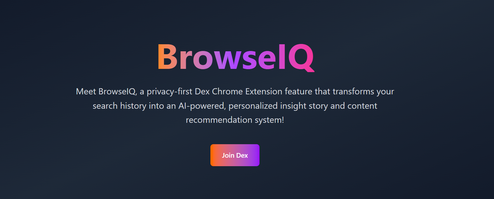
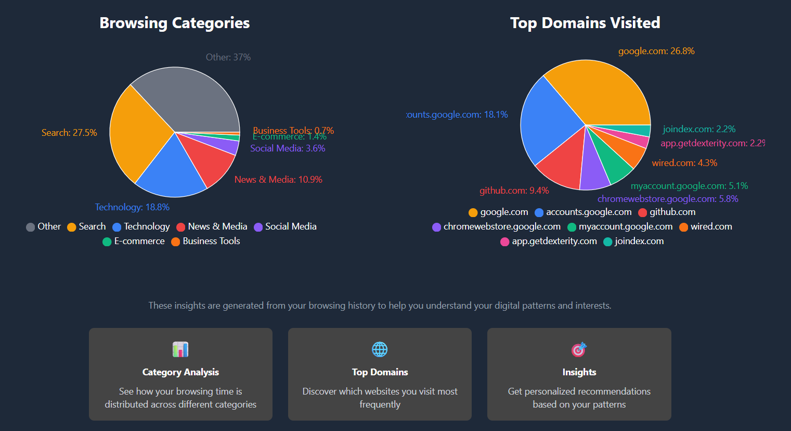
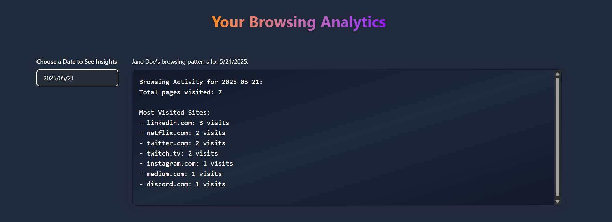

🌐 BrowserIQ — Your Smart Browser History Agent

BrowserIQ transforms your **raw browser history** into **visual insights** — helping you understand your digital habits, recall searches instantly, and visualize your browsing patterns.  
Whether you're a **student**, **professional**, or a **curious web explorer**, BrowserIQ helps you reclaim time and rediscover your top interests.

---

## Features

- **Visual Analytics** — Get graphs of your browsing categories, top domains, and visited pages.  
- **Smart Search Summaries** — Turn raw URLs into categorized topics and insights.
- **Real-Time Updates** — Built-in hot-reload for instant UI and backend feedback.  
- **AI-Powered Processing** — Uses LangChain for URL content retrieval and Dex MCP for orchestrating browsing history tools.

---

## Tech Stack

| Layer | Tools & Frameworks |
|:------|:--------------------|
| **Frontend** | Orchid, Tailwind CSS |
| **Backend** | TRAE, Dex, Bolt |
| **Data Processing** | LangChain, CSV → JSON transformation |
| **Visualization** | D3.js / Chart.js (integrated through Orchid frontend) |

---

## Dashboard Previews

### Daily Browsing Summary  
Displays total pages visited, top domains, and browsing activity per day.

---

### Browsing Insights & Categories  
Understand your time distribution across **Technology**, **Search**, **Media**, and more — all visualized in real-time.

---
